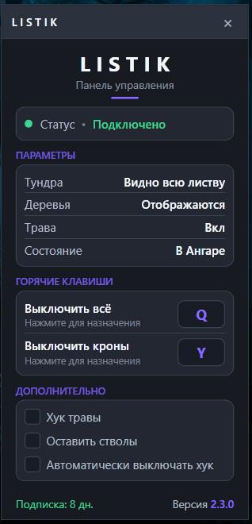

# 🌲LISTIK — Ваш инструмент для чистого поля боя



> **🚀 [Скачать последнюю версию](https://github.com/LISTIK-Tundra/Tundra-Mir-Tankov/releases/latest)**

**Tundra Mir Tankov** — это легковесная программа для игры **Мир Танков (World of Tanks)** от разработчика Леста, созданная для улучшения игрового восприятия. Она убирает визуальный "мусор" (листву и кусты), оставляя только игровые модели и ландшафт, что особенно полезно для стримов, записи видео или просто для комфортной игры.

---

## ✨ Ключевые возможности

| Функция | Описание |
| :--- | :--- |
| **Отключение кустов и листвы** | Полностью убирает кроны деревьев и кустарники. Враг не спрячется за "призрачной" зеленью. |
| **🚀 Умное переключение в ангаре** | Программа автоматически определяет, находитесь ли вы в **бою** или в **ангаре**, и включает/выключает отображение деревьев, чтобы вы могли наслаждаться красивым видом техники в гараже. |
| **🌿 Отключение микротравы** | Возможность отдельно убрать мелкую траву, которая мешает обзору на некоторых картах. |
| **🔒 Безопасная активация** | Для активации подписки используется официальный Telegram-бот, что гарантирует безопасность вашего аккаунта. |

---

## 📥 Установка и запуск

1.  Скачайте последнюю версию программы из раздела [Releases](https://github.com/LISTIK-Tundra/Tundra-Mir-Tankov/releases) (или нажмите на кнопку вверху).
2.  Запустите файл `Listik.exe` **от имени администратора** (обязательно для корректной работы с игровым процессом).
3.  Введите ваш ключ активации, полученный у бота.
4.  Запустите игру и наслаждайтесь чистым полем боя!

---

## 💬 Активация подписки

Подписка активируется через официального бота:

> **[➡️ @TundraTankiBot в Telegram](https://t.me/TundraTankiBot)**

Обратитесь к боту для приобретения ключа активации и получения всех инструкций.

---

## 🛠️ Для разработчиков (сборка из исходников)

Проект написан на **C#** и требует Visual Studio с поддержкой .NET Framework.

1.  Клонируйте репозиторий:
    ```bash
    git clone https://github.com/LISTIK-Tundra/Tundra-Mir-Tankov.git
